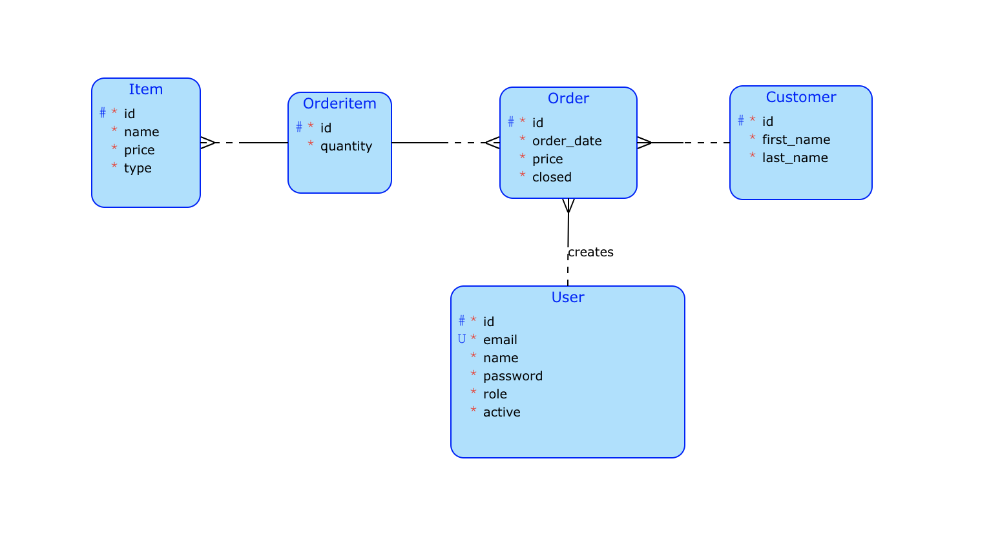

# Bar aplikace
`User` (zaměstnanec baru) má možnost vytvářet a upravovat `Order`y objednané `Customer`y. V menu je také možné spravovat `Item`y a prohlížet statistiky.

## Schéma


## Dotaz
#### Formulace
Vyberte nejoblíbenější `Item` objednaný mezi startDate a endDate.
#### Využití
Užitečné pro prohlížení statistik.

## Komplexní operace
#### Popis
Pro statistiky je potřeba získat informaci o tom, který `Customer` nejčastěji zadával objednávku od aktuálního `User`.
#### Průběh
Nejprve bude do API odeslán požadavek na získání takových informací, poté pomocí Principal server určí, který uživatel aktuálně používá aplikaci, poté bude odeslán požadavek do databáze a DTO bude přeneseno na stranu klienta.

# Příprava a spuštění

V adresáři `bar`
```
/mvn clean install
```
```
/mvn spring-boot:run
```